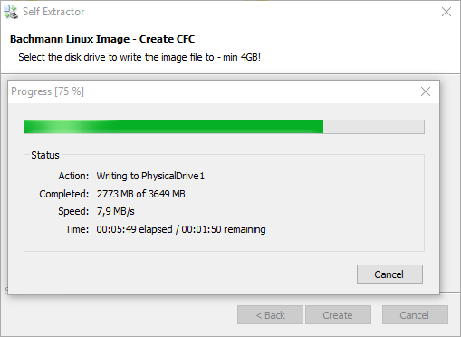

== Update the installation programme via USB

  - download the programme to be installed -> extract the zip-compressed folder -> run the .exe file
  - Choose the disk drive to write the image file to (USB-disk) -> create
  

  
  - Writing the Linux image file to USB will start automatically
  

  
  - A confirmation is returned after successful writing
  
image::Successfully created.png[]

  - Unplug USB from computer and plug it on OT1xxx and restart it
