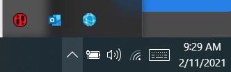
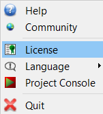
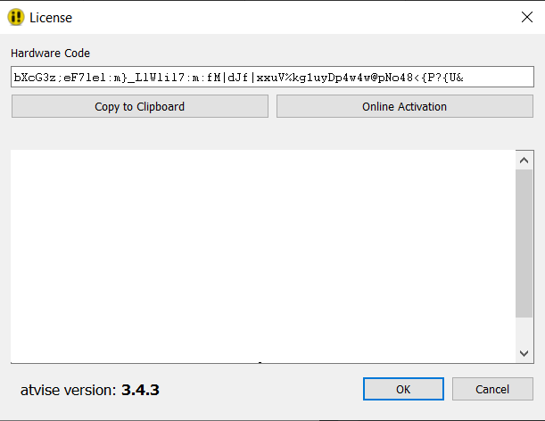
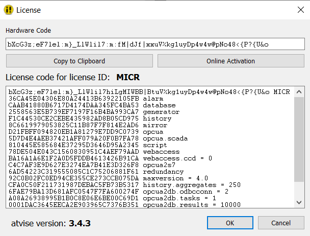

== OPCUAS_SCADA_M1_Controller

This guide shows you how to add an OPC UA service on your bachmann PLC and how to make the OPCUA connection between the M1 controller and SCADA.

=== Step 1. Getting a license for atvise®scada

First download the latest version of atvise®scada from the following link:
http://customer.atvise.com/en/customer-area-downloads-en/category/111-atvise-3-5

After the installation of atvise®scada, the icon image::atvise monitor icon.png[] will be shown on your task bar.

Right click on this icon and choose 'License'.

There are two options to obtain a license:

  1. Manual activation
      Copy the hardware code and send it to your bachmann contact. A license code will be returned,
      which has to be copied into the empty field. Confirm with OK

      
  2. Online activation
      If you have an atvise account, choose "Online activation" and follow the activation steps.
      
      
=== Step 2. Installing an OPC UA service on the controller
