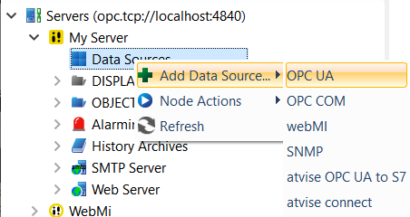

== OPCUAS_SCADA_M1_Controller

This guide shows you how to add an OPC UA service on your bachmann PLC and how to make the OPCUA connection between the M1 controller and SCADA.

=== Step 1. Getting a license for atvise®scada

First download the latest version of atvise®scada from the following link:
http://customer.atvise.com/en/customer-area-downloads-en/category/111-atvise-3-5

After the installation of atvise®scada, the icon below will be shown on your task bar.

image::icon_location.png[]

Right click on this icon and choose 'License'.

The following screen will show.

image::license_popup.png[]
There are two options to obtain a license:

  1. Manual activation
      Copy the hardware code and send it to your bachmann contact. A license code will be returned,
      which has to be copied into the empty field. Confirm with OK.
      
  2. Online activation
      If you have an atvise account, choose "Online activation" and follow the activation steps.

      
=== Step 2. Installing an OPC UA service on the controller

To install the OPC UA the Bachmann OPCUA_Server.Vx-yy.exe has to be installed.
After the installation the OPC UA can be installed on the controller.

Go to the Online Device -> Software -> Right click 'Services' -> New -> Service.

Choose "Local" and browse to the installation path of the OPCUA.m file.
Most likely: C:\Bachmann\Mbase\Target-M1\Bootdevice\srv.

Select the opcuas.m file and press next

This will show the following OPCUA configuration window.

NOTE: If there is no valid license for the OPC UA, enable the DemoMode to run the OPC UA.
      This OPC UA Demo will run for two hours, before it has to be restarted. (rebooting PLC)
      
Set the parameters as needed and confirm with finish. The complete description about these parameters are in the manual located in: bachmann\M1sw\doc\OPC UA Server.

The controller needs to reboot to finish the installation and run the OPC UA.

=== Step 3. Connect the controller to atvise®scada

Open the builder

Open My Server -> right click 'Data Sources' -> Add Data Source -> OPCUA.

In the following screen you only need to fill in 'Name' and 'Source URL'.
The source URL should look like this: opc.tcp://M1 ip-Adr:opcua Server port.

press 'ok'. 

now double click on the OPCUA connection.

The following screen should show connection : YES.

=== Step 4. Getting the SVI variables from the M1-controller to atvise®scada

To get the SVI variables into Scada, right click on the Data source and "Browse"

Now you can browse through the M1.
The software modules are located in 'Objects' -> 'Device'.

image::svi2.png[]

select one or more SVI's and right click 'Copy'

Right click on 'Objects' -> 'Paste & mirror' -> In/OutPut -> Structure from data source instances.

Enter a variable name or keep the same name as in the M1 controller by pressing 'Yes' or 'Yes to All'.

After these steps the variables are connected to atvise®scada and can be used.
By double clicking on a variable, the changes and parameters will be shown.

NOTE : without a license the OPCUA service will stop after two hours and atvise®scada will no longer receive the SVI's. Rebooting the PLC will get the OPCUA service back to running.
