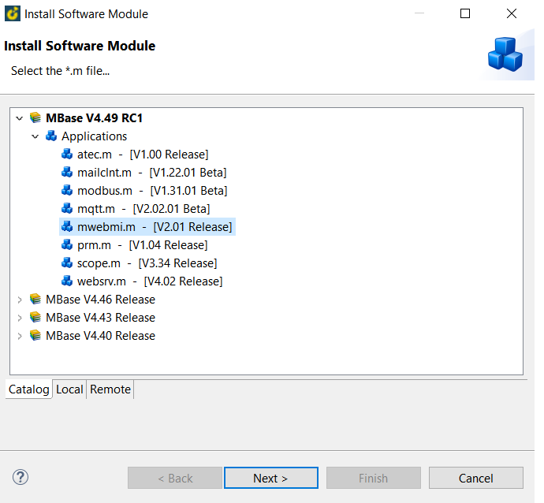
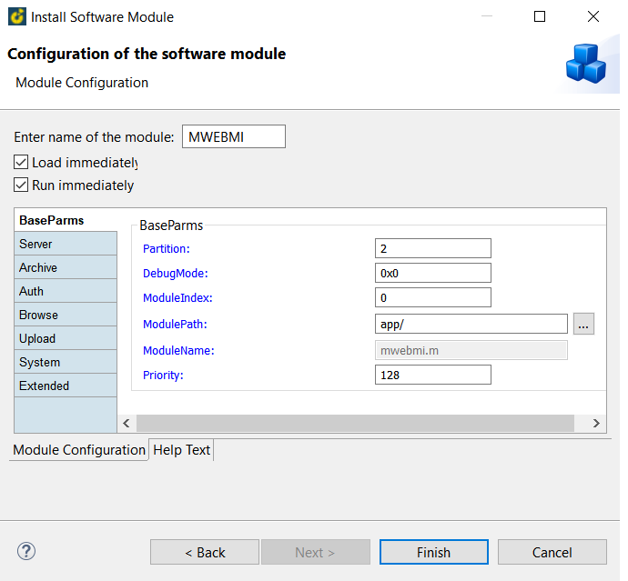
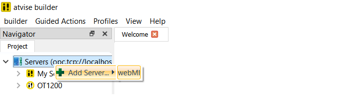
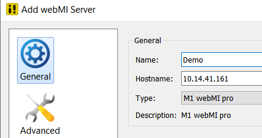
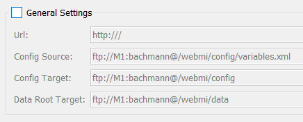
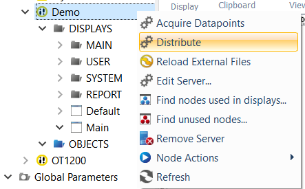

== M1webMI pro guide

This guide shows you how to add a webMI application on your bachmann PLC, how to add a webMI in atvise and how to distribute it.

=== Step 1. Adding the M1webMI pro key to your bachmann PLC.

=== Step 2. Adding a mwebMI software module to the PLC.

First open your online device in solution center > Software > Right click applications > New > SW-module.

image::webmi1.png[]

Select the latest version of the mwebmi.m file and press next.

Turn on run immediately and run permanently and press finish.

NOTE: If you open srv you can change the port, enable alarms/history and enable redirect. Enable redirect allows you to just use the ipadress in the browser to get to the webpage.

Your software module is now running.

=== Step 3. Adding a webmi server to atvise.

Start the server on atvise.

right click on servers > Add > webmi.

On the next screen fill in the name of the webmi you like, at hostname type the IP adress of the PLC with the webmi software module and last select M1 webMI pro at type.

NOTE: Make sure the paths to the directory's are shown like the image below. If this isn't the case add them manually.

Now add some objects to the main display and save. 

Right click on your webmi server > Distribute

To see the result go to your browser and type the IP adress of the PLC + port 8080. 

example: 10.14.41.161:8080
