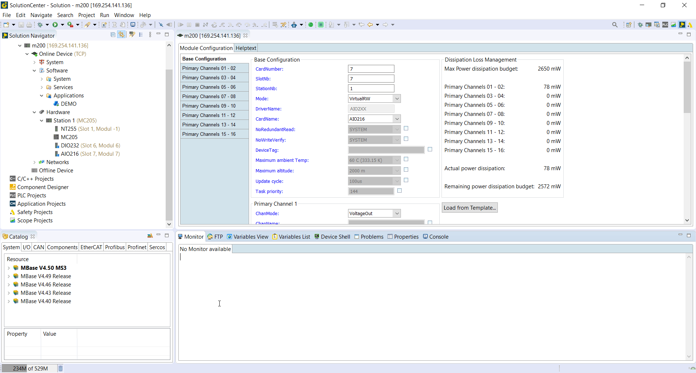

== SVI Server, SVI Client and MIO example

Simple C++ example application on how to create a SVI Server, SVI Client and MIO (digital and analog input/output). The implementation can be found in the "demo_app.cpp" and "demo_app.hpp". All the other files are from the default C++ template.

=== Importing and running the example program

