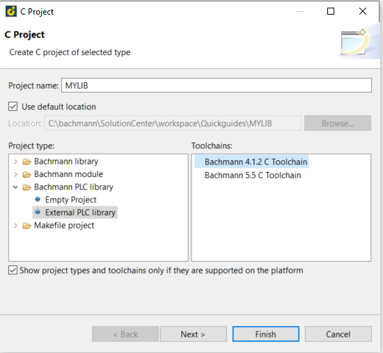
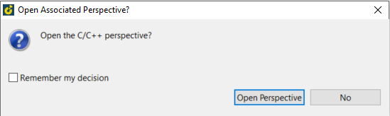
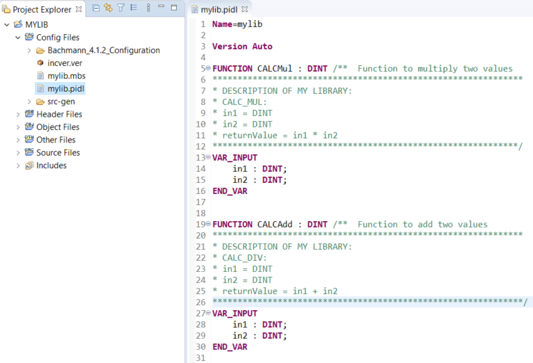
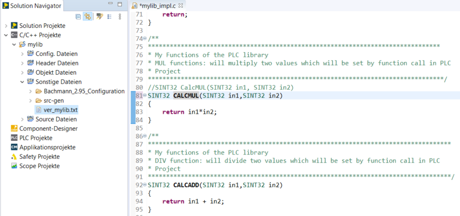
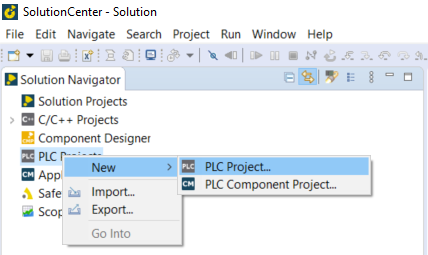

=== 1) Create a C/C++ Project which include the code of your library

image::create c-projekt.png[]

=== 2) Enter a name of your library and choose Bachmann PLC library with Toolchains 
- Select "Next" to choose of Sample code or
- "Finish" to create C-project

- you can decide to stay or change the perspective

- Main needed Files:
  . mylib.pidl:   Definition and interface to PLC
  . mylib_impl.c  Code and functionality of the library functions.
  
=== 3) Sample: Create mul and add functions in "mylib.pidl"

add your Function-name with input and in case of function-Blocks the output variable to *.pidl file.

=== 4) Create functionality of the functions in "mylib_impl.c"

Save changes and wait until build of project is finished.

=== 5) Implementation of library in PLC
- create a new PLC-project

=== 6) Use functions in PLC-project
- Add library
- choose "Workspace" if the c-project of the library is in same workspace. otherwise choose "Browse" and browse to location where the library is stored.
- Call the functions in PLC_PRG 
- In debug-mode you can see the result of your functions in PLC-developer.

image::PLC.gif[]

