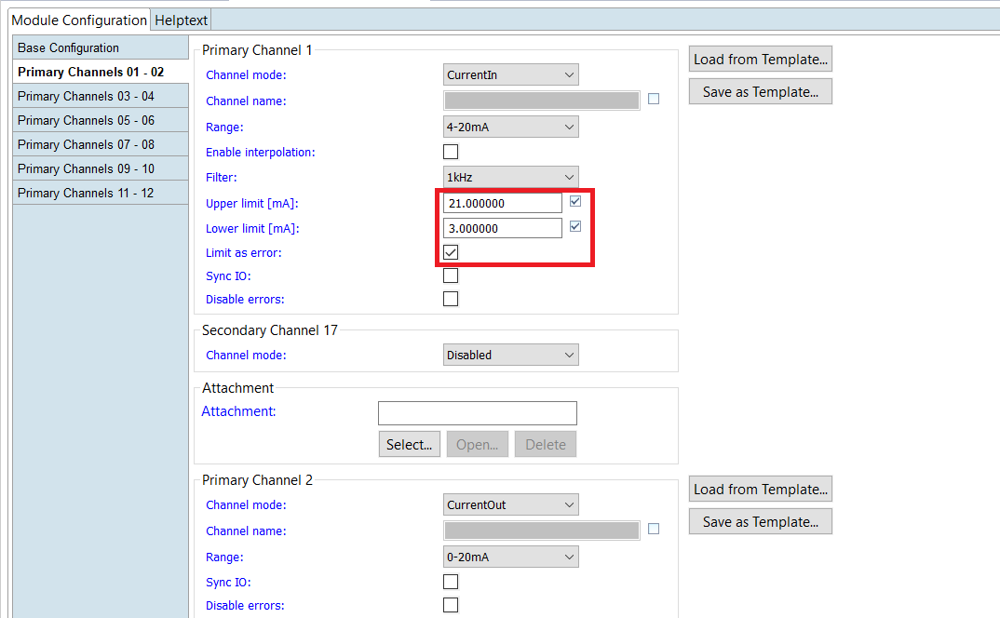
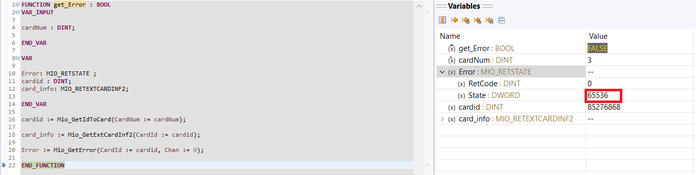

= Read specific error and event interrupts from GIO212, AIO216 and AIO208 in PLC

== Current configuration from GIO212 in SolutionCenter

    - click on GIO212
    - go to primary Channels 01-02

    -> Primary Channel 1:  
                          * Mode:     CurrentIn
                          * Range:    4-20mA                      
    -> Primary Channel 2:  
                          * Mode:     CurrentOut
                          * Range:    0-20mA
                          
     - under `pin Assignment´ you can see how the channels are connected
     - than now you can save the configuration and reboot.
     - after reboot hardware symbol will show red(error).
     - we can have this error in plc using function `MIO_GetError´
     
===  Possible configuration errors 
   
   - if `Limit as error´ is inactive and `CurrentIn < 4mA´ :   Open circuit, Lowerrange exceeded
   
image::inactive_Ie_klein_4mA.png[] +

   - if `Limit as error´ is inactive and `CurrentIn > 20mA´ :  Upperrange exceeded
   
image::inactive_Ie_gross_20mA.png[] +

   - if `Limit as error´ is aktiv and `CurrentIn < Lower limit(7mA)´:   Lowerrange exceeded
   
image::aktiv_Ie_klein_7mA.png[] +

   - if `Limit as error´ is aktiv and `CurrentIn > Upper limit(19mA)´:  Upperrange exceeded
   
image::aktiv_Ie_gross_19mA.png[] +
  
  
  
IMPORTANT:  if Disable errors is activated, all errors are eliminated: +

                              

== Build function Mio in plc

        - create a new PLC_Projekt
        - insert Mio_plc.plclib
        - create a function to get error
        - Call function in plc_Prg
        - Compile and debug the plc_Prg
        - With a breakpoint we can have under `State´ the error
        - The error information is returned in form of a bit mask
        - in this case: status = 65540 => Open circuit, Lowerrange exceeded(on device protocol)
        
image::plc_simulate.gif[]

       - Function to get error_information
       
image::Function_Error.png[]

=== Case of Limit as error is activated

    - The configuration of GIO212 is almost the same as above, the only change is to activate `Limit as Error´ from primary channel:
    
            -> Primary Channel 1:  
                                      * Mode:     CurrentIn
                                      * Range:    4-20mA 
                                      * Upper limit: 21mA
                                      * Lower limit: 3mA
                                      * Limit as erroR: activate
                                      

                                      
    - in this case: status = 65536 => Lowerrange exceeded(on device protocol)   
    

