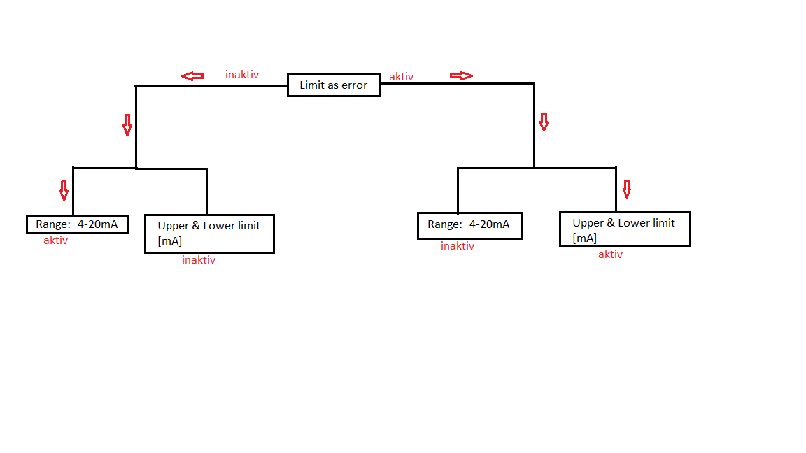
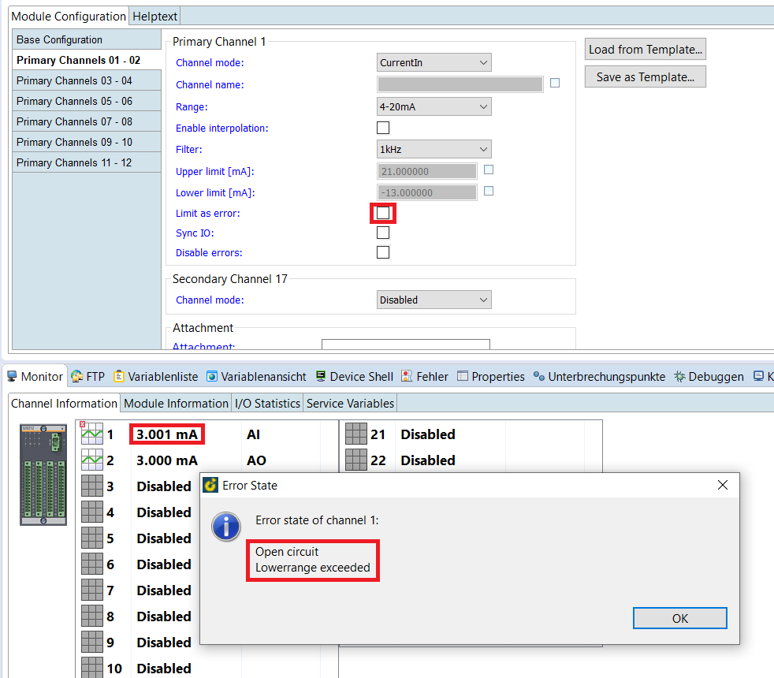
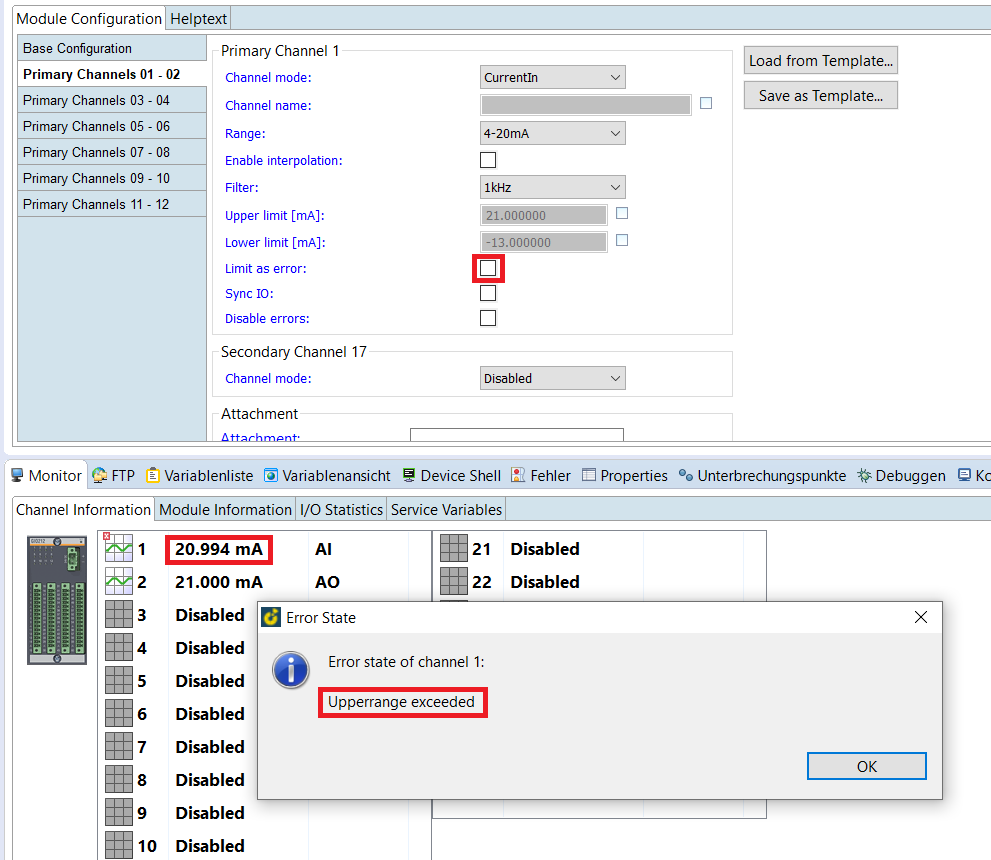
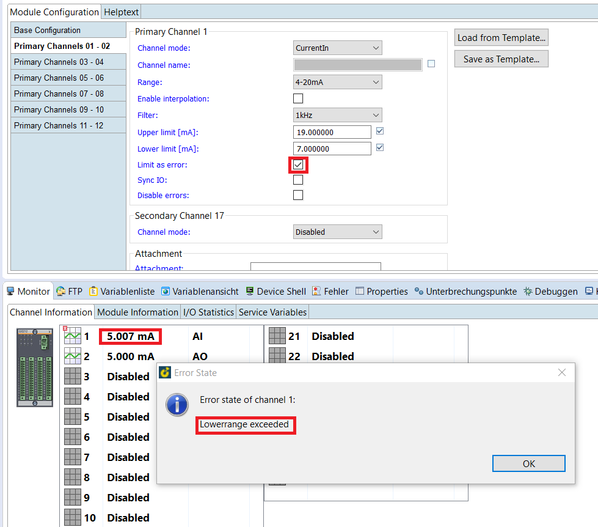
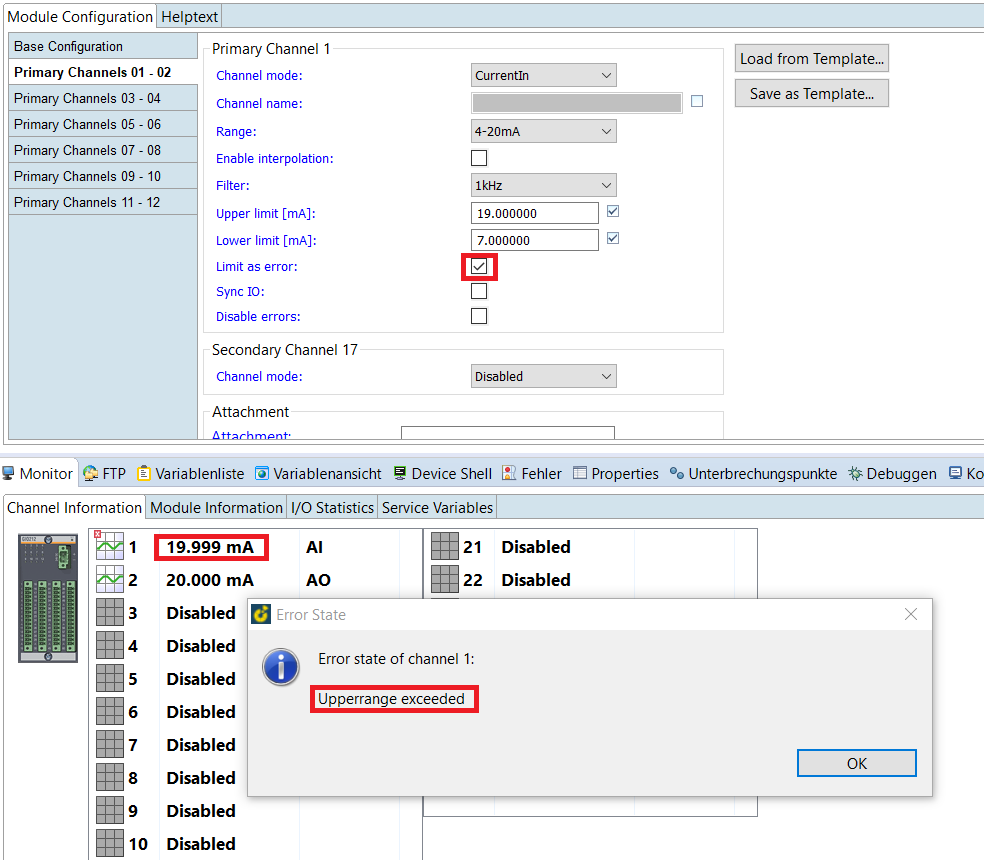
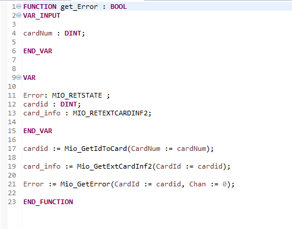
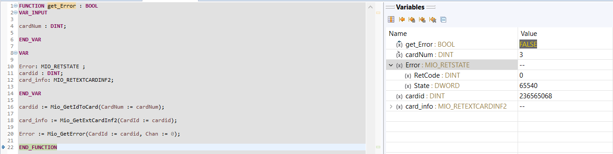
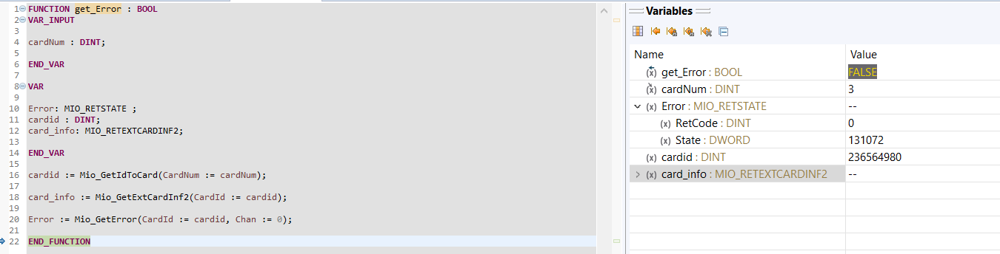
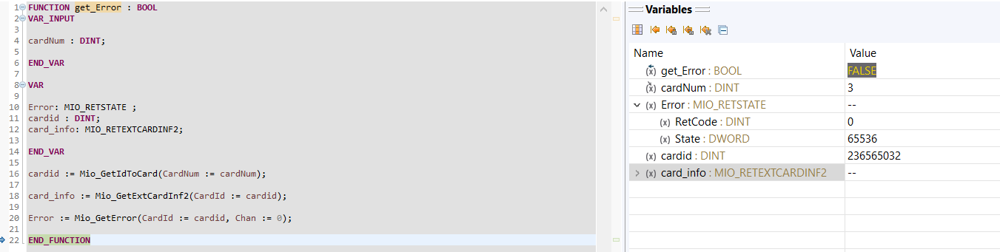
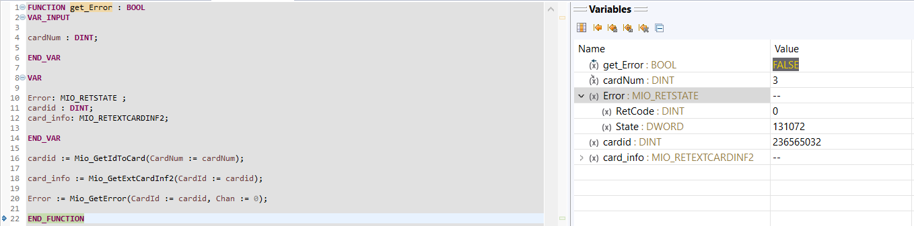

= Read specific error and event interrupts from GIO212, AIO216 and AIO208 in PLC

== Current configuration from GIO212 in SolutionCenter

    - click on GIO212
    - go to primary Channels 01-02

    -> Primary Channel 1:  
                          * Mode:     CurrentIn
                          * Range:    4-20mA                      
    -> Primary Channel 2:  
                          * Mode:     CurrentOut
                          * Range:    0-20mA
                          
     - under `pin Assignment´ you can see how the channels are connected
     - than now you can save the configuration and reboot.
     - after reboot hardware symbol will show red(error).
     - we can have this error in plc using function `MIO_GetError´
     
===  Possible configuration errors and graphical representation

   
   - if `Limit as error´ is inactive and `CurrentIn < 4mA´ :   Open circuit, Lowerrange exceeded
   
 

   - if `Limit as error´ is inactive and `CurrentIn > 20mA´ :   Upperrange exceeded
   
 

   - if `Limit as error´ is aktiv and `CurrentIn < Lower limit(7mA)´: Open circuit, Lowerrange exceeded
   
 

   - if `Limit as error´ is aktiv and `CurrentIn > Upper limit(19mA)´:  Open circuit, Upperrange exceeded
   
 
  
  
  
IMPORTANT:  if `Disable errors´ is activated, all errors are eliminated: +

                              

== How to get error in plc ?

        - create a new PLC_Projekt
        - insert Mio_plc.plclib
        - create a function to get error
        - Call function in plc_Prg
        - Compile and debug the plc_Prg
        - With a breakpoint we can have under `State´ the error
        - The error information is returned in form of a bit mask
        
image::plc_simulate.gif[]

       - Function to get error_information
       

=== Case of error in different configuration:

- `Limit as error´ is (inactive) and `CurrentIn < 4mA´: State = 65540   =>  Open circuit, Lowerrange exceeded

- `Limit as error´ is (inactive) and `CurrentIn > 20mA´:  State = 131072 => Upperrange exceeded

- `Limit as error´ is (active) and `CurrentIn < Lower limit´:  State = 65536 => Lowerrange exceeded

- `Limit as error´ is (active) and `CurrentIn > Upper limit´:  State = 131072 => Upperrange exceeded

IMPORTANT:  constants for error interrupts

- With the following link you can see the general description of specific error interrupts

-> http://127.0.0.1:55297/help/topic/at.bachmann.msys.api.help/html/group___m_i_o-_d_e_f-_r_e_t.html?cp=0_6_0_1_2_3_2_0_57#ga604bd15a713d955d07417969f4fa3767

-> you can also have this specific description in Mio_plclib under global variables:

image::constants.png

image::specific error.png

Lowerrange exceeded = 16#00010000   =>      65536   +
Upperrange exceeded = 16#00020000   =>      131072  +
Open circuit        = 16#0004       =>      4   +

                                      
