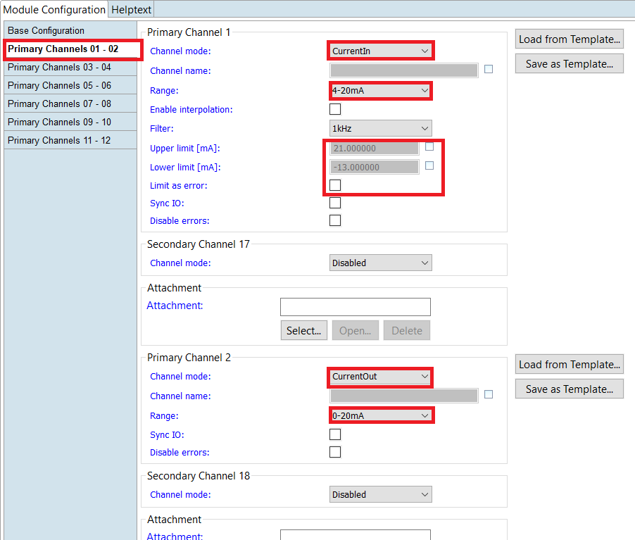

= Read specific error and event interrupts from GIO212, AIO216 and AIO208 in PLC

== First step: Current configuration from GIO212 in SolutionCenter

    ->   Limits as error:   not activated

    - Primary Channel 1:  
                          * Mode:     CurrentIn
                          * Range:    4-20mA                      
    - Primary Channel 2:  
                          * Mode:     CurrentOut
                          * Range:    0-20mA
                          
        

