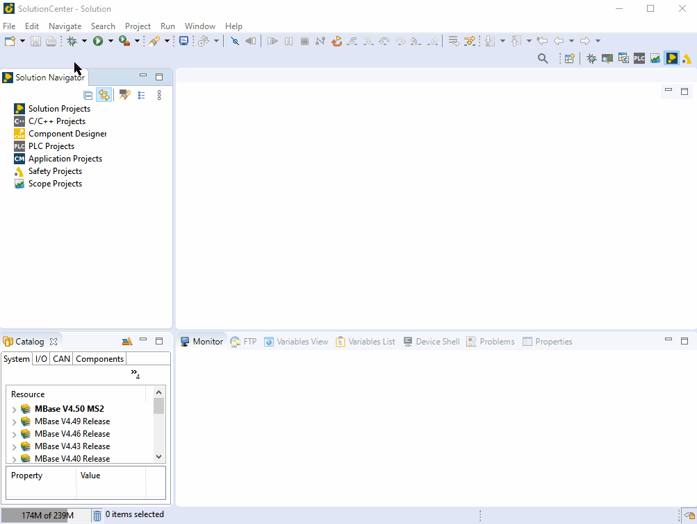
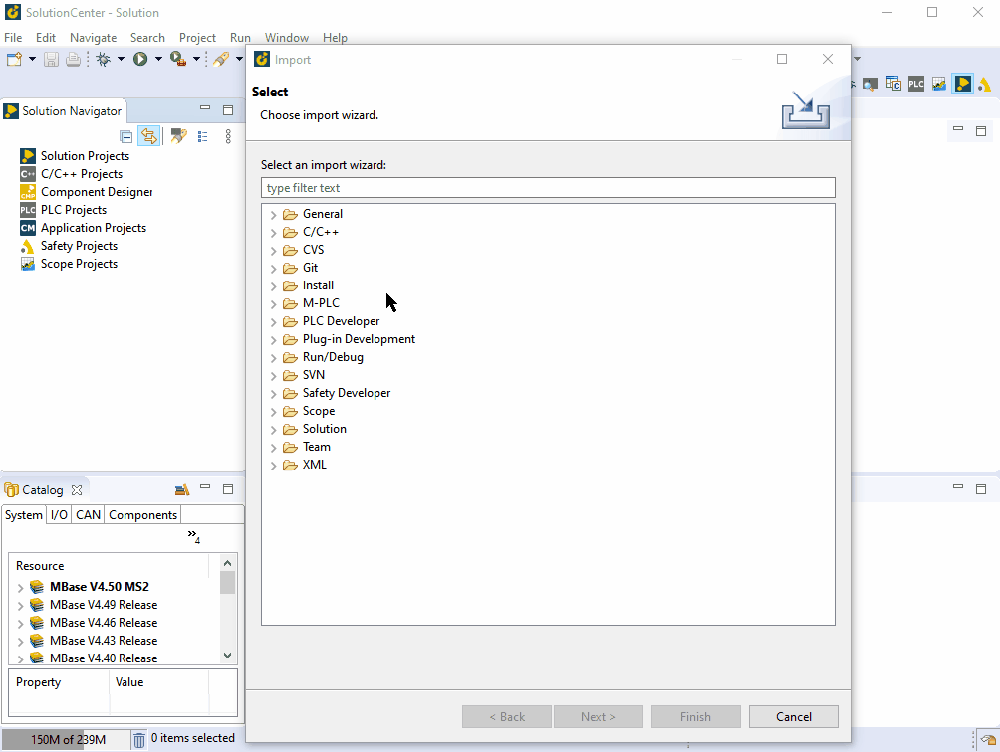
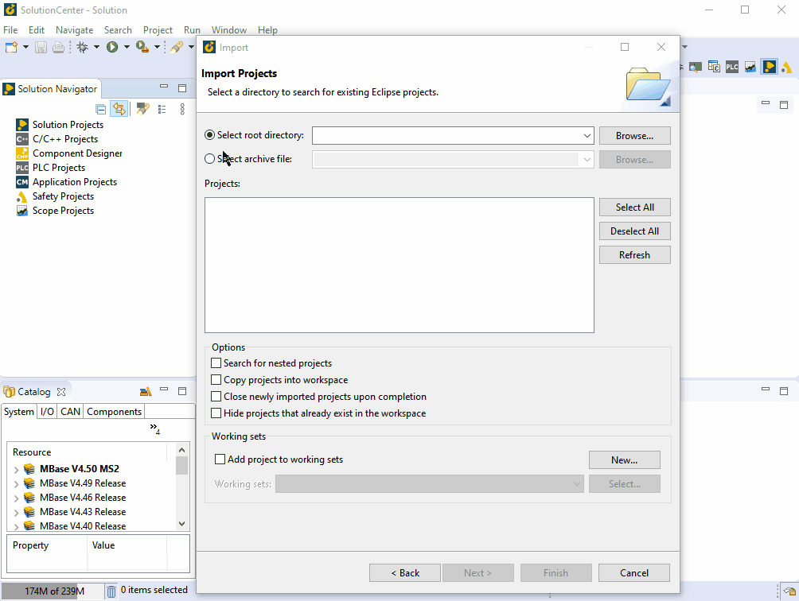

=== import a project from zip-file

===== 1. choose File -> import in you solution center workspace

	
===== 2. select General -> Existing Project into workspace 

[NOTE]
if needed you can use the search box to get the correct one.

===== 3. Browse to the zip file select the files to import and confirm with OK

