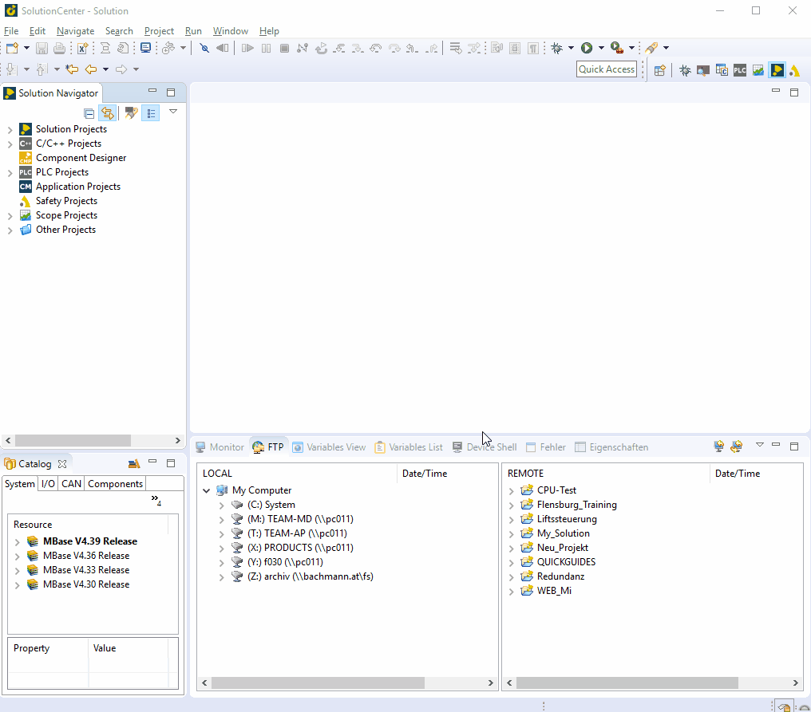

=== quick statement notation

		- At PLC_Developer to write instructions quickly or without errors, there is an easy combination to call it: (_)+Stgr+LeerTaste
		

    	- Then you get a list of all instructions that can be used with PLC.
