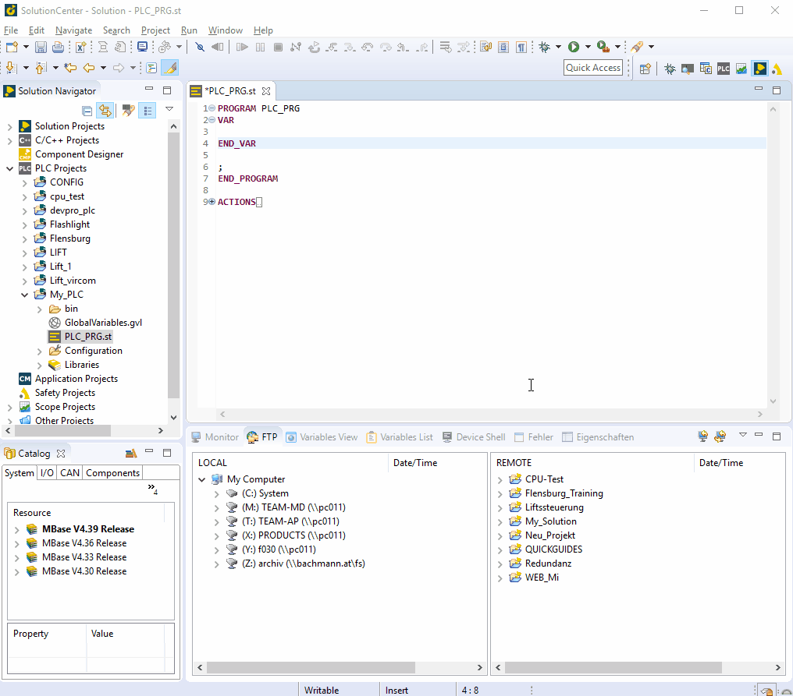

=== quick variable notation

		- With the combination (Ctrl + Space) you get an entire overview of variable.
		- By entering the first two letters of the variable with a combination of (Ctrl + Space), you have quick access to the desired name.
		 
     
