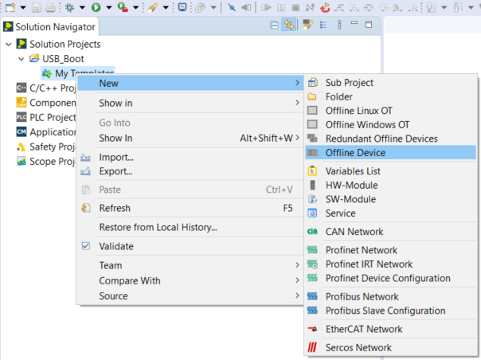
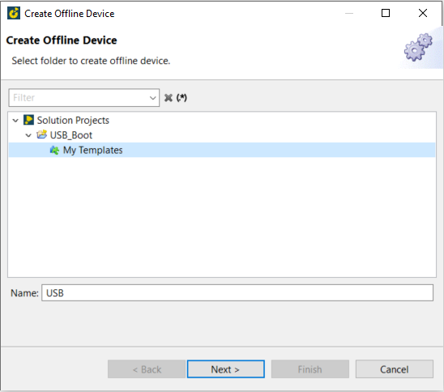
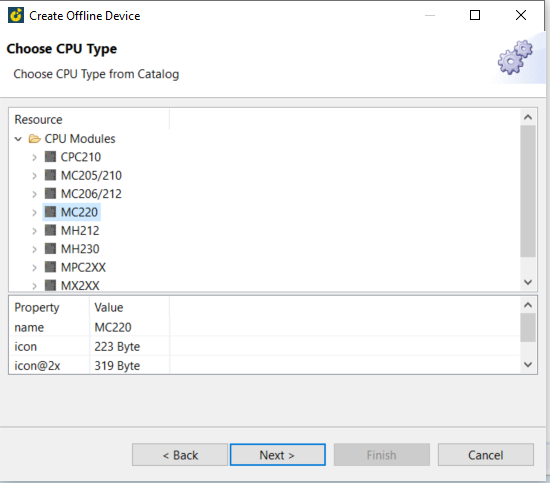
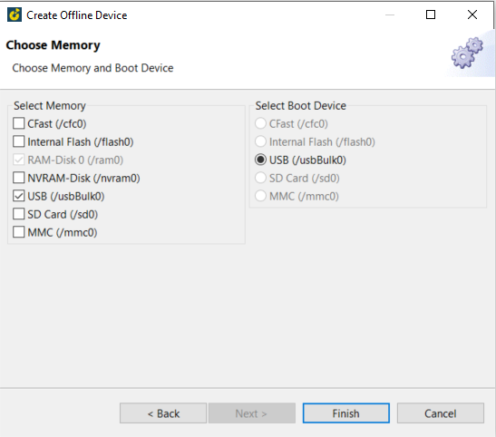
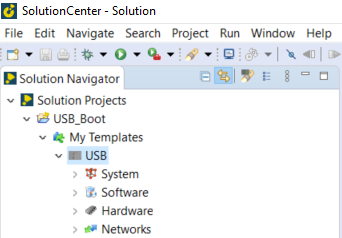
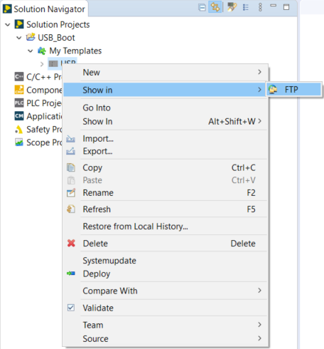
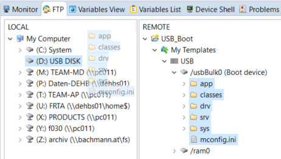
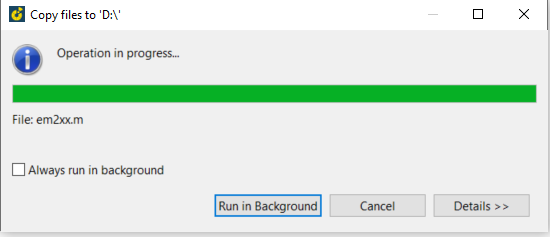

== Reboot with USB

  - Create a new Solution -> right click on "My Template" and choose "Offline Device"

  - Select "My templates" and enter a Name -> Next
  

  - Selet the CPU type you want to reboot -> Next
  

  - Just enable "USB(/usbBulb0) -> Finish
  

  - Then a USB-device will be created
  

  - Right click on Template and open it in the FTP-View
  

  - insert an empty USB-stick to your PC 
  - open "/usbBulk0" -> select files and folder -> drag and drop to the USB-stick
  

  - Wait until copy files is finished.
  

  - Now you can insert your USB-stick into CPU
  - Change the Hex-Switches to: H -> PROG and L -> 6
  - Reboot CPU
  
