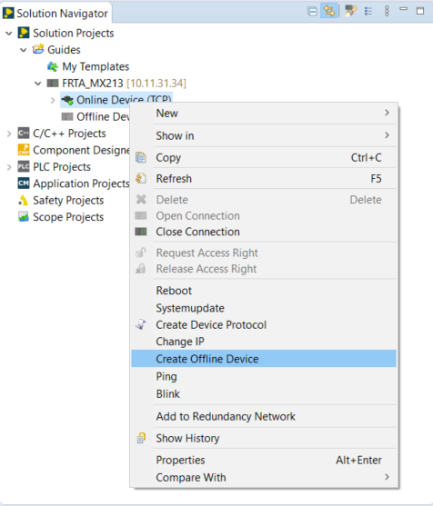
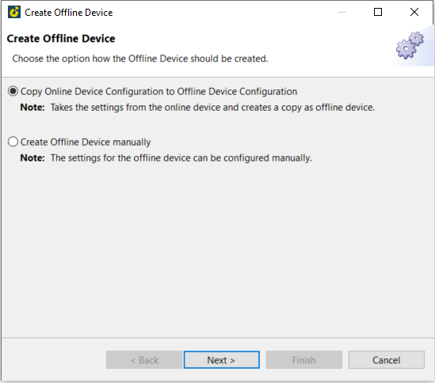
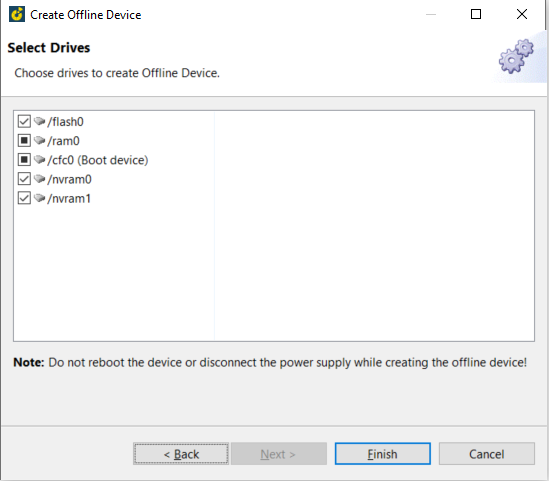
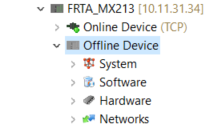
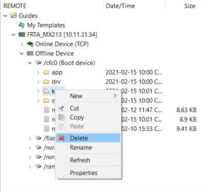
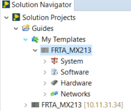
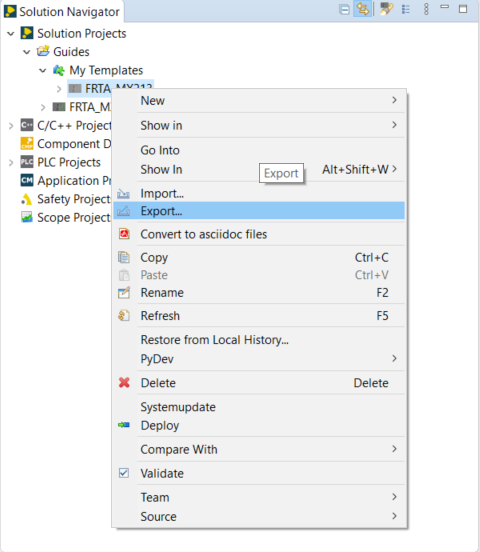

=== 1) Export the templates
- right clik on "Online Device" and create Offline device.

- Choose the option -> Next

- Select drives ( inthis case select all) - Finish

- The progress of the creation can be seen in the SolutionCenter at the bottom right

- Now the offline Device can be found in the SolutionCenter

- Delete the "Keys" folder from the offline device via FTP access

==== Save Offline Device to Template
- Drag and drop the offline device into "My templates"

- Export template

 - Select templates and enter destination archive file -> Finish
 image::9-SpeichertOrt.png[]
 
 === 2) Import the templates
 - Right click on "My templates" -> Import -> Select Solution Project -> Next
 image::10-Import.png[]
 
 - Browse to the *.scte file -> Finish
 image::11-ChooseFile.png[]
 
 ==== Deploy template to controller
 - Set name and IP address in the template -> Save
 image::12-IP.png[]
 
 - Deploy templates
 image::13-Deploy.png[]
 
 - Select online device with corresponding IP address and name - Finish
 image::14-Choosedrive.png[]
 
 - Overwriting Device
 image::15-Overwriting.png[]
 
 
 
 

