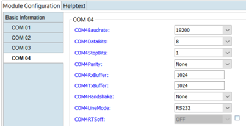
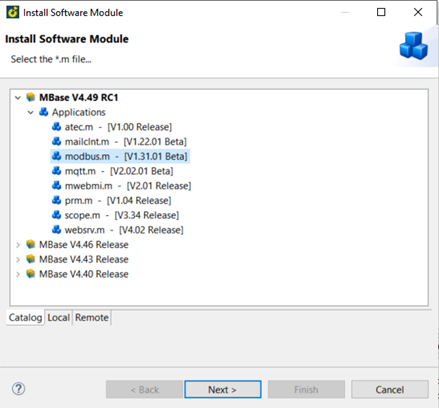
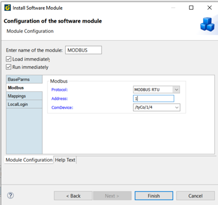
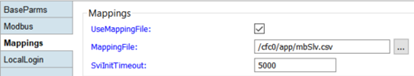

== ComDevice settings for the RS204 module

For this example com 04 from the RS204 module (virtual) is used as a slave. 

== Step 1. Adding the hardware

First add the RS204 to your hardware.

Online device > Hardware > right click new > HW-module > RS204
 

Change the com 04 settings as you please, this example is shown in the picture below.

 
== Step 2. Adding a mappingfile

Before the next step add a file via FTP called mbSlv.csv to the PLC.

Open FTP > Remote > select desired PLC > online device > /cfc0 (bootdevice) > right click on app > new > file > type mbSlv.csv > ok.

== Step 3. Configuring the modbus.m

To install the software module modbus.m.

Go to online device > software > applications > right click new > SW-module > select mod-bus.m > next

Tick load and run immediately. Go to modbus select protocol : MODBUS RTU. At the ComDevice type /tyCo/1/4. (explanation: /tyCo/modulenumber/com-port, so say you want to use the com1 port on the PLC (module 1) we type /tyCo/0/1/)

In this example the RS204 is on module 1 so the settings look like this:

 

For the last step go to mappings and tick on ‘UseMappingFile’ and select the mbSlv.csv file we created before.
 
image 5

Press finish

Double click on the ‘MODBUS’ application and go to the ‘mapping’ tab to add all desired varia-bles.

