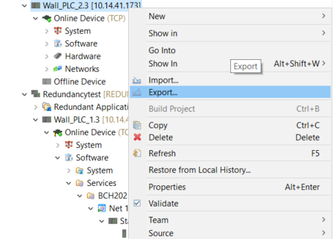
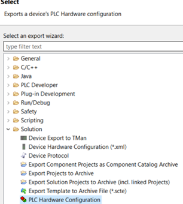
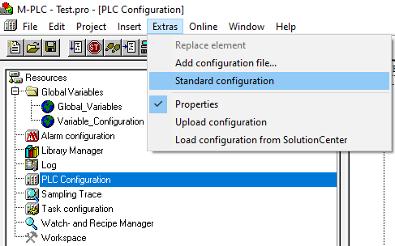
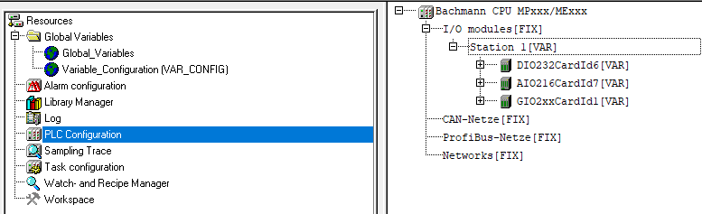

== Exporting an existing hardware configuration from solutioncenter and importing it to M-PLC

=== Step 1. Exporting the hardware configuration via solutioncenter.

In SolutionCenter > File > Export 
 

Select Solution > PLC Hardware Configuration > Select desired PLC > Save the file (.hwconfig).
  

=== Step 2. Clearing M-PLC's current hardware configuration

This step is necessary because it might otherwise go wrong during the import.

Open M-PLC > Resources 

Click on PLC Configuration > Extras > standard configuration > Select "Yes"

=== Step 3. Importing the new hardware configuration

extras > Load configuration from SolutionCenter > select .hwconf file > open. 

This results in a correctly imported hardware configuration 

