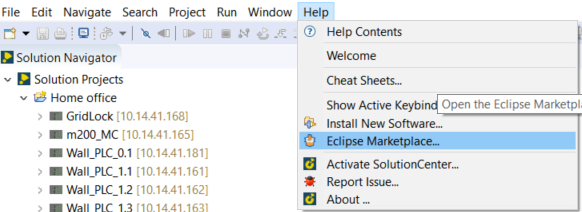
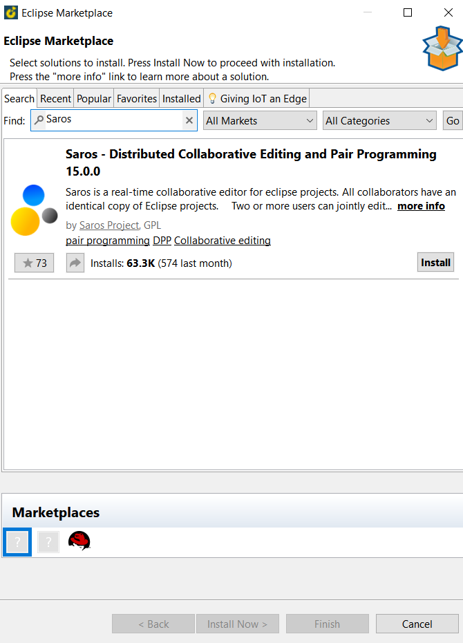
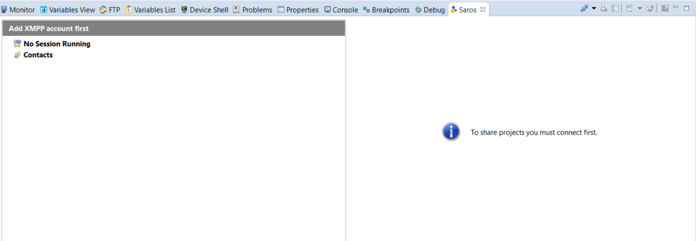

== Pairing programming with 2 or more User

=== Installing Saros
  - Go to: Help -> Eclipse Marketplace
  

  - Enter "Saros" -> Install -> Accept terms of license agreement -> Finish -> Restart SolutionCenter
  

=== Using Saros in Solutioncenter

  - if Saros is not there press the "Search symbol" and enter "Saros" +
  
 and it should show up like this:
 
 
 
  - to use Saros, you have to create an account under the following link + 
 
https://saros-con.imp.fu-berlin.de:5280/register/new 

