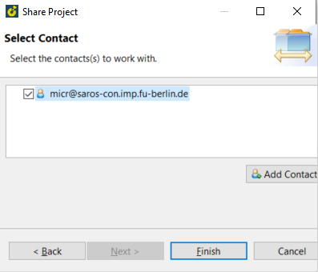

== Pairing programming with 2 or more User

=== Installing Saros
  - Go to: Help -> Eclipse Marketplace
  
image::eclipse.png[]

  - Enter "Saros" -> Install -> Accept terms of license agreement -> Finish -> Restart SolutionCenter
  
image::install_saros.png[]

=== Using Saros in Solutioncenter

  - if Saros is not there press the "Search symbol" and enter "Saros" 
  
 and it should show up like this:
 
image:search_icon.png[]
 
  - to use Saros, you have to create an account under the following link + 
 
  * https://saros-con.imp.fu-berlin.de:5280/register/new 

==== add your account-data
  - click on connect symbol -> Add account
  
image::add_account.png[]

  - Enter your Username and password
  
image::log_datei.png[]
 
  - account conncted
 

==== Add contact(s)
  - Right click on "contacts" and enter username
  

=== Tip

IMPORTANT: pairing programming is currently possible only with C/C++ projects

==== share project
  - Right click on C/C++ project or Right click on "No Session Running" -> share projects -> select projects -> next
  
image::select_project.png[]

  - select contacts -> finish
  

 
  - all projects that are shared are displayed like this:
  

==== Test pairing
  - The following animation shows how the host (line 91) and guest (line 94) can work together in a project at the same time.
  

