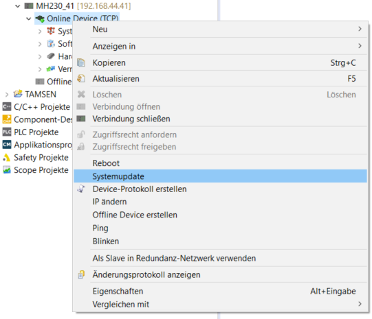
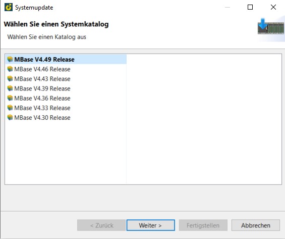
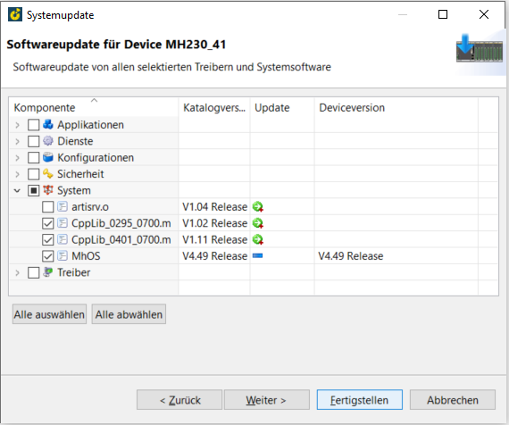
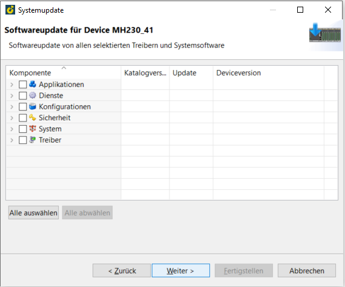
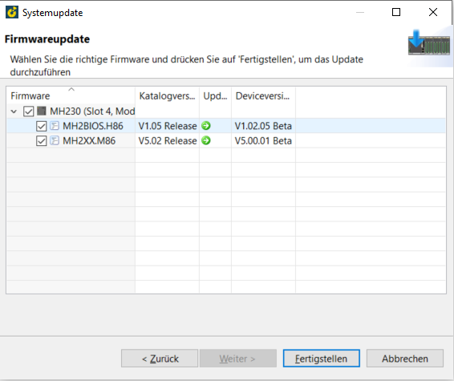

=== Softwareupdate

  a) Recht Klick auf Online Device -> Systemupdate
  

  
  b) Systemkatalog auswählen -> Weiter
  

  c) Systemsoftware auswählen -> Fertigstellen
  

  
  d) CPU neu starten
  
=== Firmwareupdate

  - gleiche Schritte wie a) und b) oben
  - Softwareupdate überspringen -> weiter
  

  - Firmware auswählen -> Fertigstellen
  

  
  - CPU neu starten
