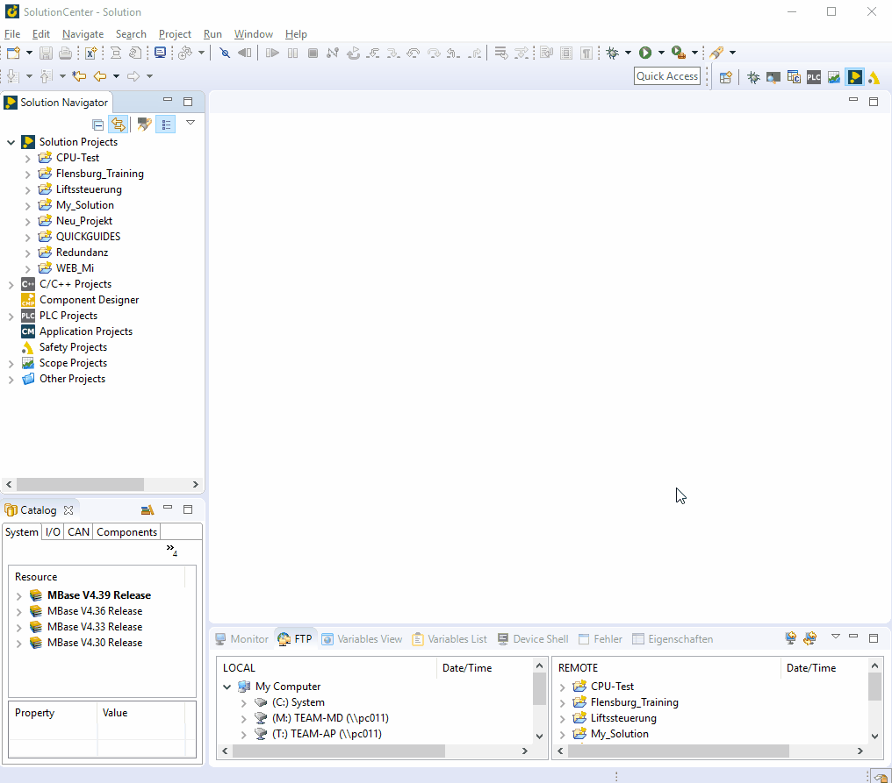

=== add a Device
	- Right click on Project -> New -> Device
	- Select folder: Search device in the network (preferably) or add manually -> continue +
	

	
			- All available hardware are displayed
			
<iframe width="560" height="315" src="https://www.youtube.com/embed/nQ7cowCpsRs" frameborder="0" allow="accelerometer; autoplay; clipboard-write; encrypted-media; gyroscope; picture-in-picture" allowfullscreen></iframe>

https://youtu.be/nQ7cowCpsRs
