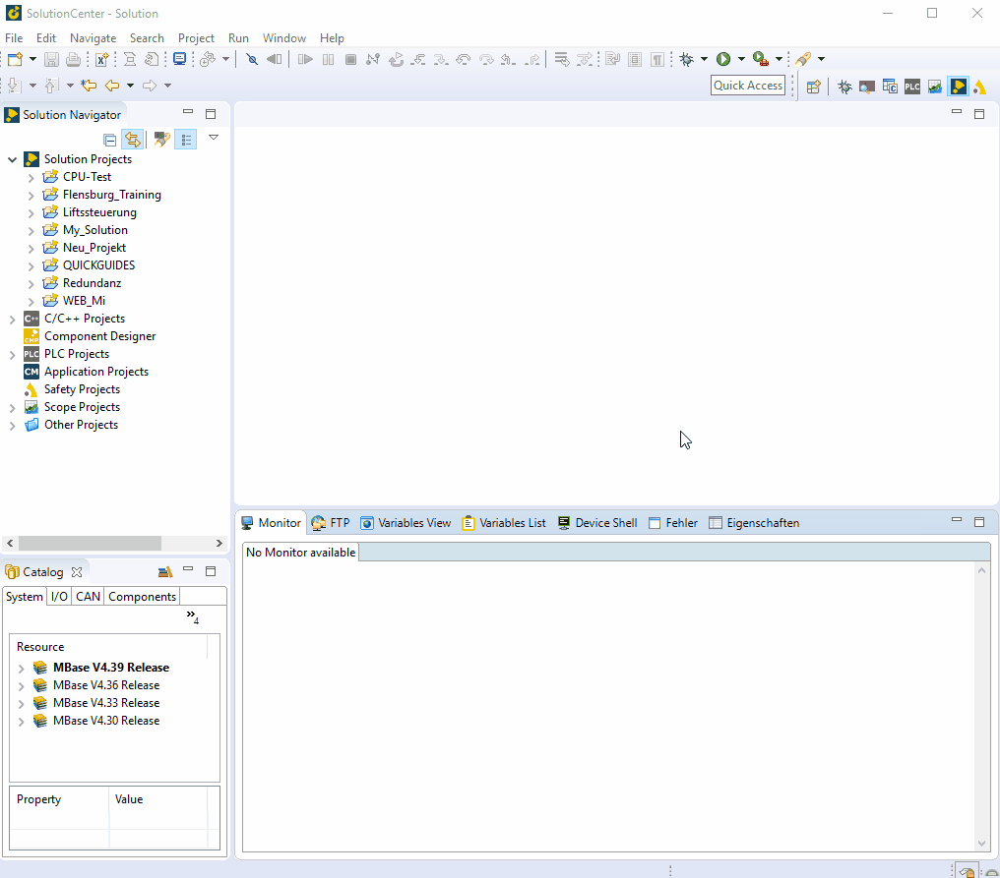

=== device reset

- under FTP -> REMOTE -> project -> nvram0 (format or reset)
- My_template(right click) -> offline device -> name of CPU -> choose CPU Type -> choose Memory -> finisch
- in cfc0, delete all data except "keys"
- New_CPU(right click) -> deploy -> choose device -> select drives to deploy -> finish -> overwrite -> reboot

