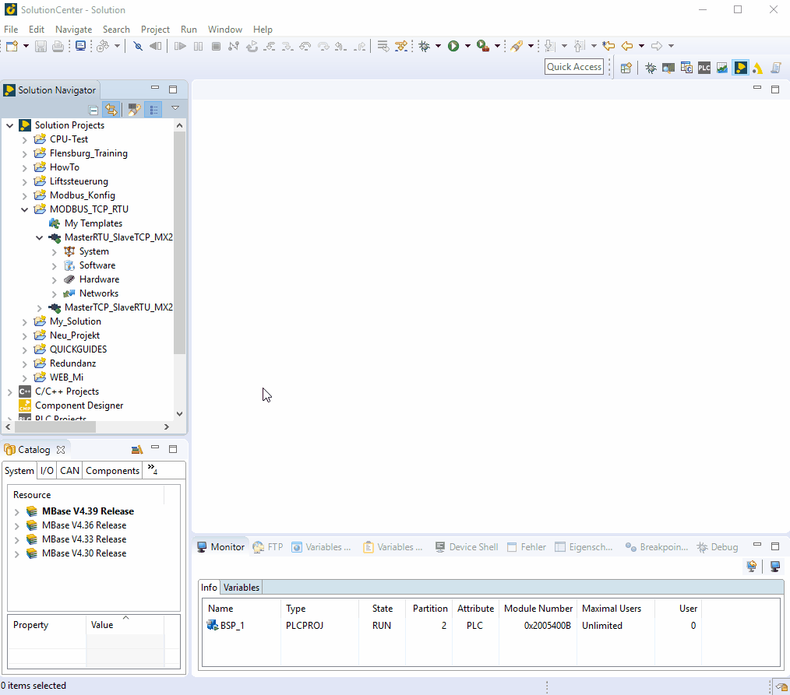

=== install/configure Modbus_TCP Slave

    - install Modbus_Modul under: Software -> Applications -> new -> SW-Modul -> choose modbus.m
    - double click Modbus_Modul to configure it: Modbus -> MODBUS TCP 
    - activate `UseMappingFile´ by Mappings to create your own variable or create a Variable List
    - select the MappingFile "mbSlv.csv" in cfc0.
   
    
    
    
=== install/configure Modbus_RTU Slave

the process is nearly at Modbus_TCP, by configuration of Modbus_Modul:

    - under Modbus: Protocol -> MODBUS RTU and Comdevice -> COM2
    - System- -> Communication -> Interfaces -> COM2(Baudrate = 19200, Transfer mode: RS485)
    - under mconfig.ini:
            * ``COM2MaxCycle = 2000´´ 
            * TickRate >= 5000

image::install Modbus_RTU Slave.gif[]
