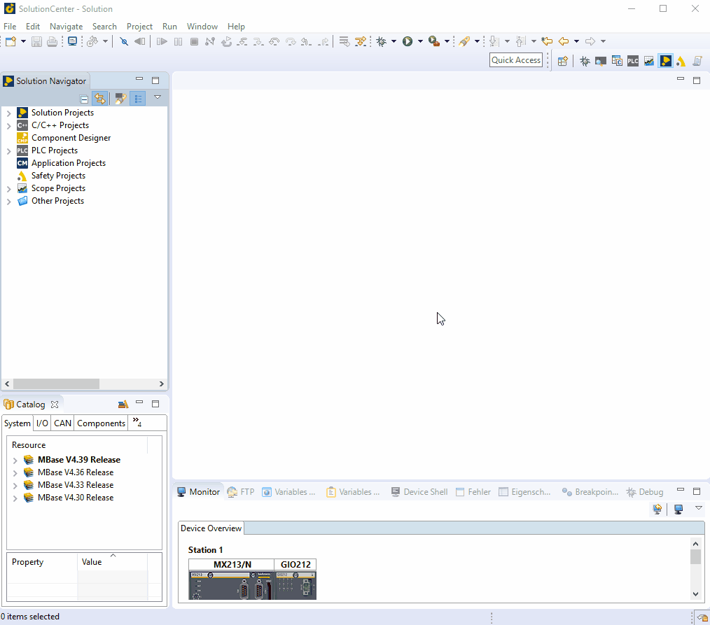

=== install/configure Modbus_RTU Master

    - under hardware: add a new hardware module -> choose mbm201 -> own configuration of cardNb, SlotNb 
    - activated `OptNode´ 
    - to MBM1 select: MODBUS RTU  and `COM2´ by ComDevice -> finish -> reboot
    - now you can configure Comdevice under: System -> communication -> interfaces -> COM2 (Baudrate: 19200, 
    Transfer mode: RS485/422)
    
    - System- -> Communication -> Interfaces -> COM2(Baudrate = 19200, Transfer mode: RS485)
    - under mconfig.ini:
            * COM2MaxCycle = 2000 
            * TickRate >= 5000

    - under Networks: select Modbus Network module -> Channels -> add channel -> change Channel Properties -> finish
    

