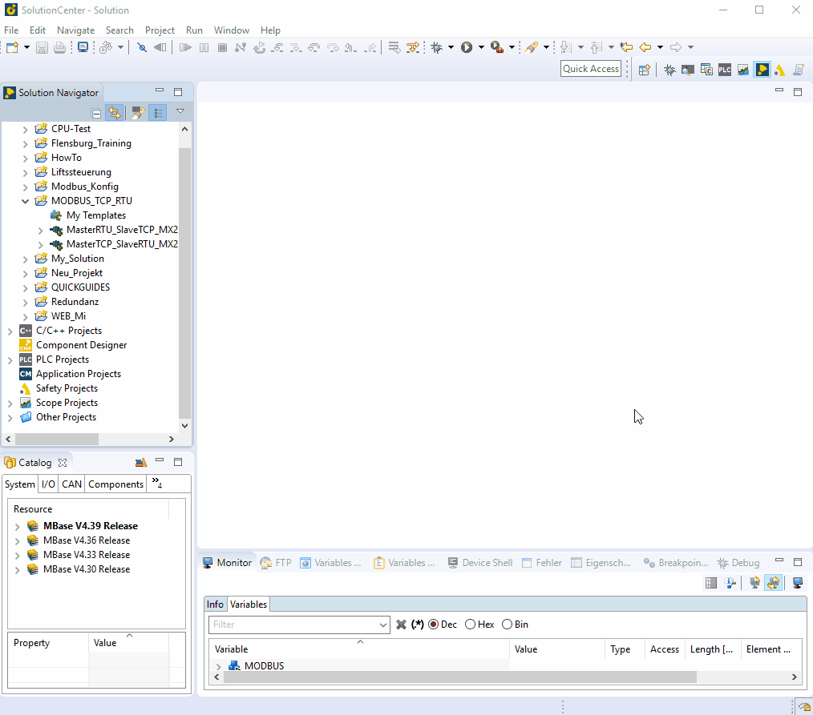

=== install/configure Modbus_TCP Master

    - under hardware: add a new hardware module -> choose mbm201 -> own configuration of cardNb, SlotNb -> activate `OptNode´ 
    - to MBM select: MODBUS TCP by protocol -> finish -> reboot
    - now you can configure Comdevice under: System -> communication -> interfaces -> COM2 (Baudrate: 19200, 
    Transfer mode: RS485/422)
    - under Networks: select Modbus Network module -> Channels -> add channel -> change Channel Properties -> finish
    

