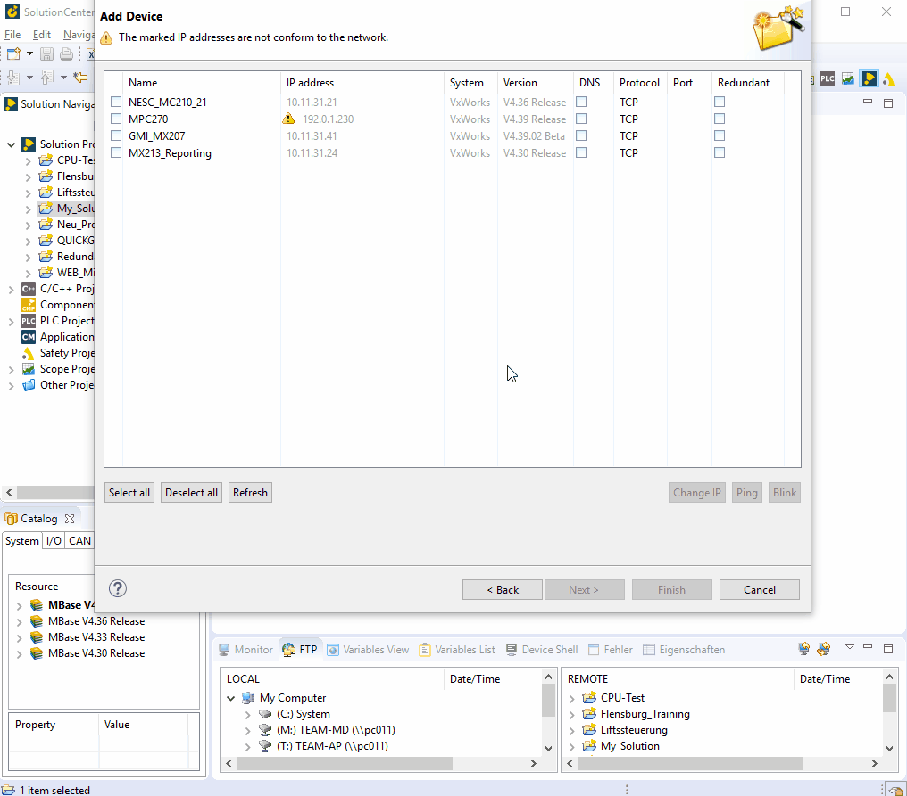

=== modify IP adress
			
			- Set H-Switch of CPU to "PROG"
			- Change IP -> enter IP-Address -> finish
			

			
IMPORTANT:  
Set H-switch to "RUN" again (otherwise CPU will switch to "ERROR" on restart)
