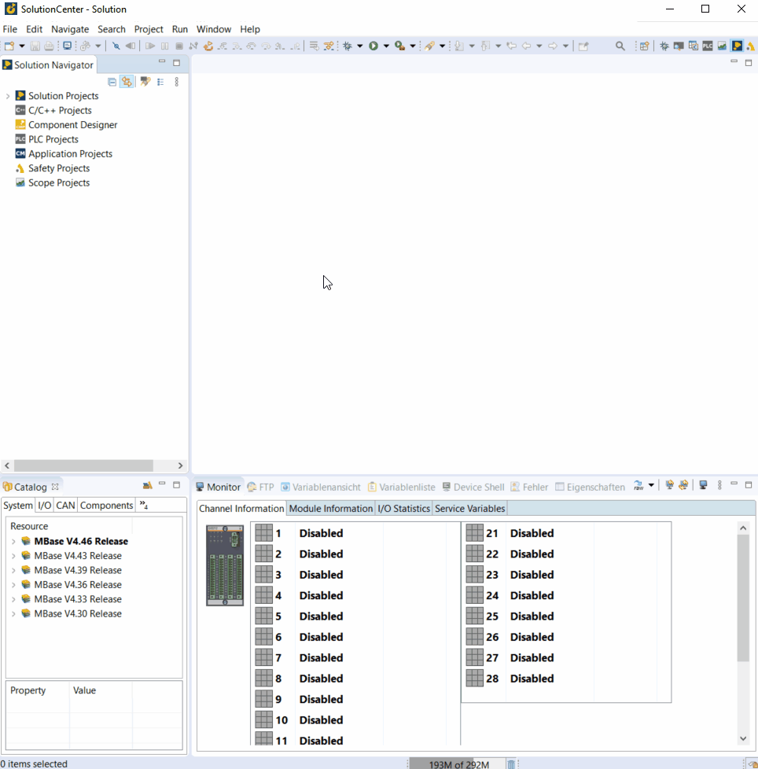

=== Scaling variable on SolutionCenter

  - activated `Scalling´ under: System -> I/O-System -> Scaling -> don´t reboot
  - configure Channels of GIO212: e.g. channels 01 - 02
  - activate `Scale type´ for the channels to be configured
  - choose the type of scalling and data type
  - configured the Scale parameters
  - defines a name and unit for the scaled value
  - reboot
  - The defined name is displayed in `Variables View´
  

